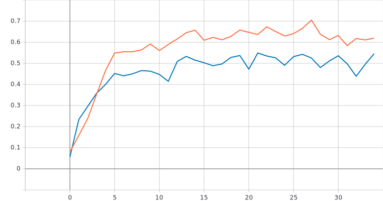
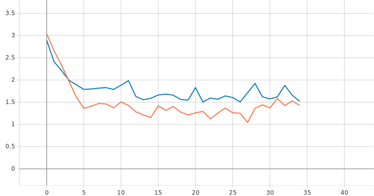

# С использованием примера [2] обучить нейронную сеть EfficientNet-B0 [3,4,5] (случайное начальное приближение) для решения задачи классификации изображений Oregon WildLife [6]


- Описание архитектуры:
  Создаём тензор
```
inputs = tf.keras.Input(shape=(RESIZE_TO, RESIZE_TO, 3))
```
Свёрточный слой с 8-ю фильтрами и ядром 3X3

```
x = tf.keras.layers.Conv2D(filters=8, kernel_size=3)(inputs)
```

Уменьшаем дискретизацию данных выбором максимального значения
```
 x = tf.keras.layers.MaxPool2D()(x)
```

Переводим многомерный тензор в одномерный
```
 x = tf.keras.layers.Flatten()(x)
```

Приводим результат к вероятностному виду при помощи полносвязного слоя с 20 выходами и функции активации softmax
```
 outputs = tf.keras.layers.Dense(NUM_CLASSES, activation=tf.keras.activations.softmax)(x)
```

-Графики обучения:
 - Валидация - синий цвет
 - Тренировка - оранжевый цвет
   
   График метрики качества
  
  
  График функции потерь
  


# С использованием [2] и техники обучения Transfer Learning [7] обучить нейронную сеть EfficientNet-B0 (предобученную на базе изображений imagenet) для решения задачи классификации изображений Oregon WildLife
-Архитектура:

Нейронная сеть с 5-ю конволюционными слоями
```
   inputs = tf.keras.Input(shape=(RESIZE_TO, RESIZE_TO, 3))
  x = tf.keras.layers.Conv2D(filters=8, kernel_size=3)(inputs)
  x = tf.keras.layers.MaxPool2D()(x)
  x = tf.keras.layers.Conv2D(filters=16, kernel_size=3)(x)
  x = tf.keras.layers.MaxPool2D()(x)
  x = tf.keras.layers.Conv2D(filters=24, kernel_size=3)(x)
  x = tf.keras.layers.MaxPool2D()(x)
  x = tf.keras.layers.Conv2D(filters=32, kernel_size=3)(x)
  x = tf.keras.layers.MaxPool2D()(x)
  x = tf.keras.layers.Conv2D(filters=40, kernel_size=3)(x)
  x = tf.keras.layers.MaxPool2D()(x)
  x = tf.keras.layers.Flatten()(x)
  outputs = tf.keras.layers.Dense(NUM_CLASSES, activation=tf.keras.activations.softmax)(x)
```

-Графики обучения:
 - Валидация - синий цвет
 - Тренировка - оранжевый цвет
   
   График метрики качества
  
  
  График функции потерь
  

 # Анализ результатов
 На графиках видно, что после добавления 4 слоёв качество обучения нейронной сети не увеличилось.Добавление слоёв лишь увеличило глубину нейронной сети и соответсвенно увеличило время обучения. По результатам графиков тренировки и валидации можно сказать что нейронная сеть переобучилась.
