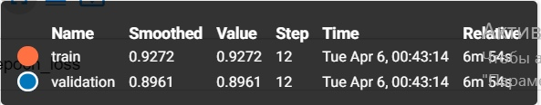
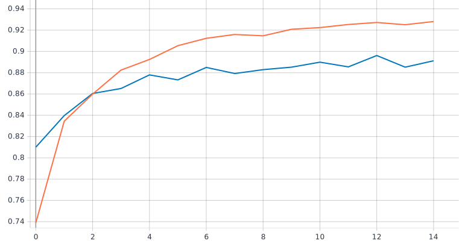
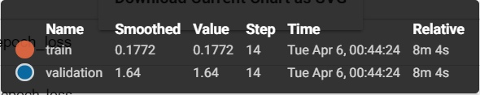
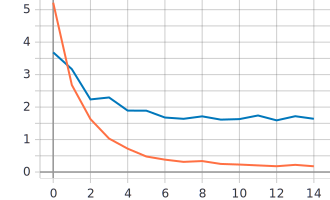
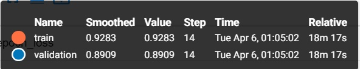
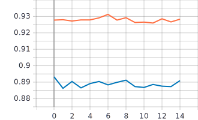
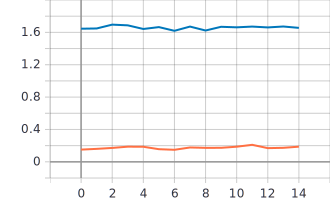

# Лабораторная работа #5.
 # Решение задачи классификации изображений из набора данных Oregon Wildlife с использованием нейронных сетей глубокого обучения и техники обучения Fine Tuning
#  С использованием примера [2], техники обучения Transfer Learning [1], оптимальной политики изменения темпа обучения, аугментации данных с оптимальными настройками обучить нейронную сеть EfficientNet-B0 (предварительно обученную на базе изображений imagenet) для решения задачи классификации изображений Oregon WildLife

 
- Графики: Transfer Learning

- Для точности

 
   
   График точности
  
  
  - Для функции потерь
  
  
  
  График функции потерь
  
  
  
  - Графики: Fine Tuning

- Для точности

 
   
   График точности
  
  
  - Для функции потерь
  
  
  
  График функции потерь
  
  
 
