# Изучение влияние параметра “темп обучения” на процесс обучения нейронной сети на примере решения задачи классификации Oregon Wildlife с использованием техники обучения Transfer Learning
# 1) С использованием [1] и техники обучения Transfer Learning обучить нейронную сеть EfficientNet-B0 (предварительно обученную на базе изображений imagenet) для решения задачи классификации изображений Oregon WildLife с использованием фиксированных темпов обучения 0.1, 0.01, 0.001, 0.0001
-Графики обучения: Только валидация

-Для метрики качества

 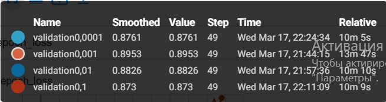
   
   График метрики качества
  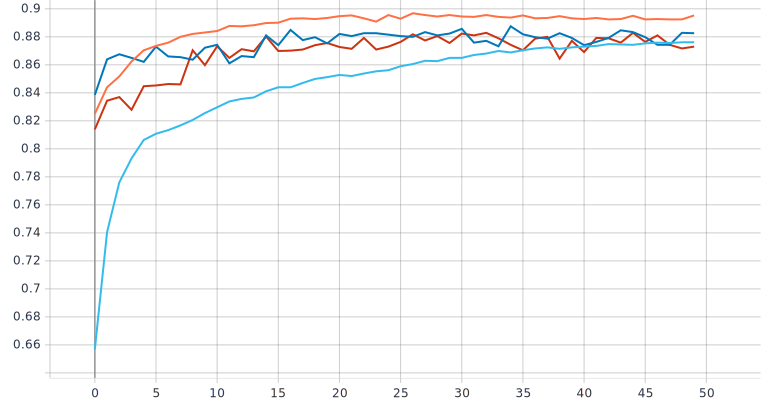
  
  -Для функции потерь
  
  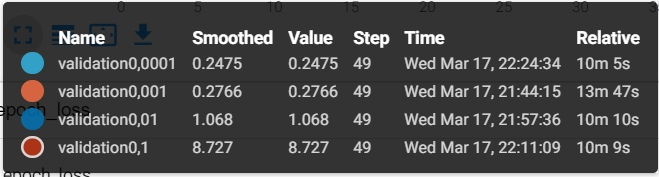
  
  График функции потерь
  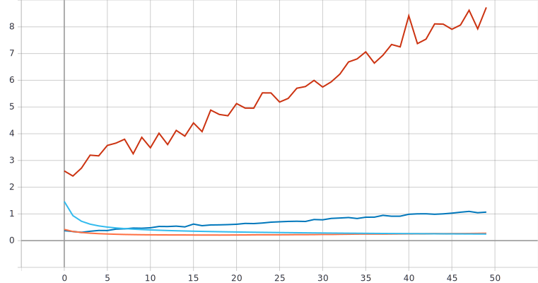
  
  # При использовании шага обучения 0.001 достигается наилучшее качество на валидации равное 89,53%;

# 2) Реализовать и применить в обучении следующие политики изменения темпаобучения [2], а также определить оптимальные параметры для каждой политики: a. Пошаговое затухание (Step Decay) b. Экспоненциальное затухание (Exponential Decay)

# a. Step Decay
Графики обучения: Только валидация

-Для метрики качества

 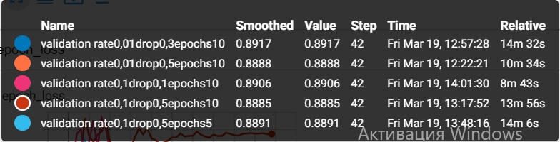
   
   График метрики качества
  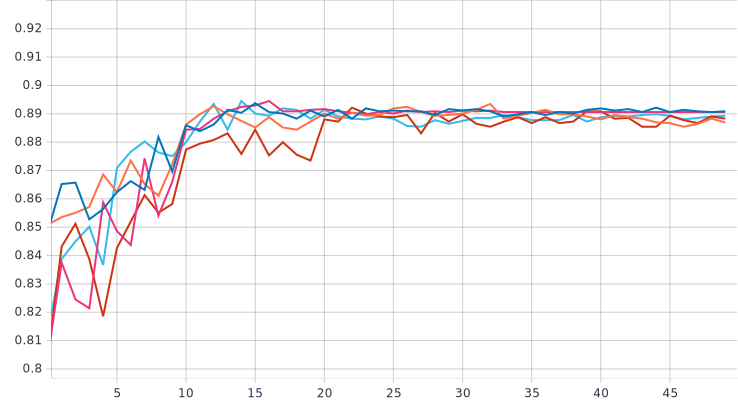
  
  -Для функции потерь
  
  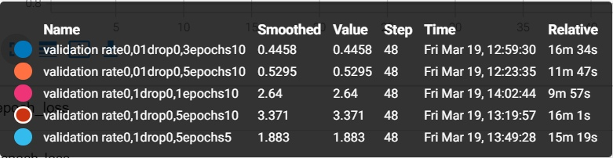
  
  График функции потерь
  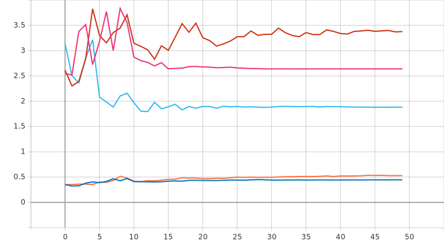

 # Лучшие параметры: начальное значение темпа обучения - 0.01 со снижением в 0.3 раза каждые 10 эпох. Эти параметр приводят к наивысшему значению метрики качества (89,17%), но алгоритм не превзошёл алгоритм с оптимальным фисированным темпом.
 
# b. Exponential Decay
Графики обучения: Только валидация

-Для метрики качества

 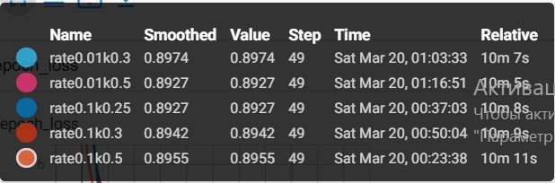
   
   График метрики качества
  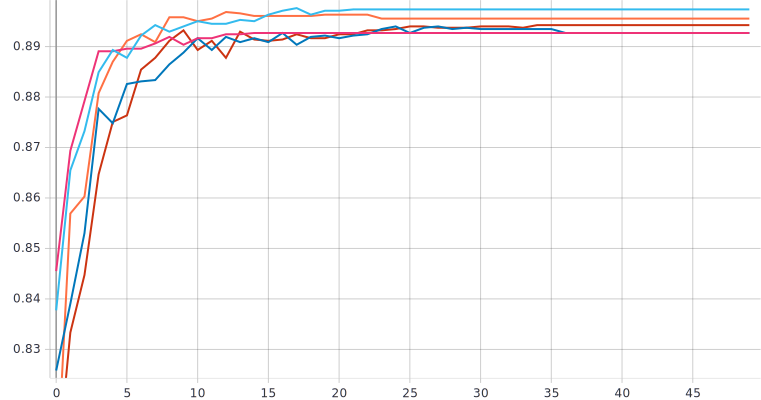
  
  -Для функции потерь
  
  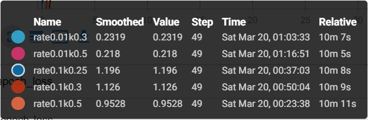
  
  График функции потерь
  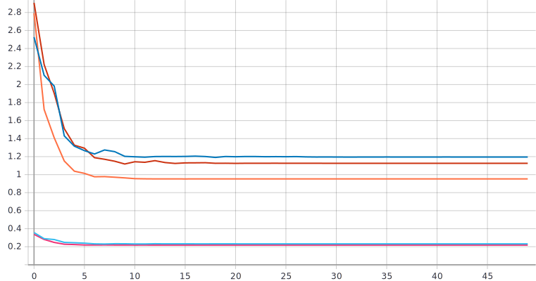

# Анализ результатов
 
