# Лабораторная работа #4.
 # Использование техник аугментации данных для улучшения сходимости процесса обучения нейронной сети на примере решения задачи классификации Oregon Wildlife
# С использованием [1], техники обучения Transfer Learning  и оптимальной политики  изменения темпа обучения обучить нейронную сеть EfficientNet-B0 (предварительно обученную на базе изображений imagenet) для решения задачи классификации изображений Oregon WildLife с использованием следующих техник аугментации данных:
 ### В данной лабораторной мы используем политику изменения темпа обучения Exponential Decay: начальное значение темпа обучения - 0.1 с фактором наклона экспоненциальной кривой 0.3.
# 1) Манипуляции с яркостью и контрастом
- Графики: 
- Только валидация

- Для метрики качества

 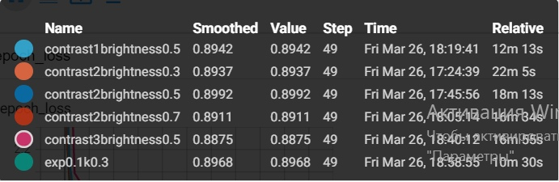
   
   График метрики качества
  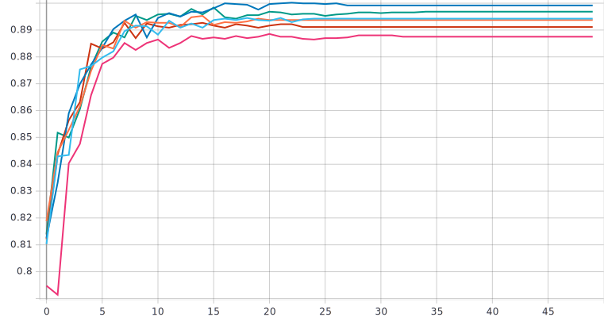
  
  - Для функции потерь
  
  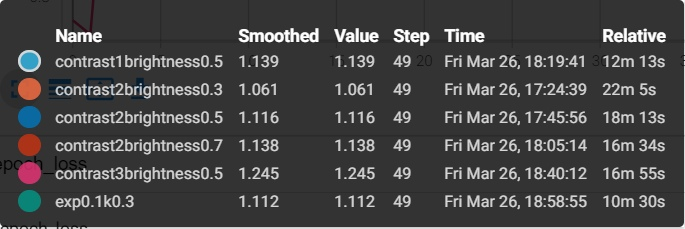
  
  График функции потерь
  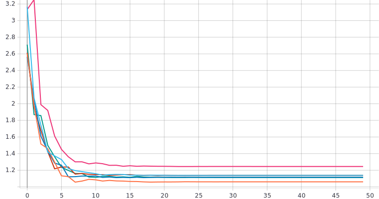
  
  ### Лучшими параметрами для данной части стали: фактор контраста - 2 и изменение яркости - 0.3. При такой комбинации мы смогли достичь максимальной метрики качества(89,92% , что на 0,24% лучше чем у алгоритма без аугментации данных) и наилучшей скорости сходимости(26 эпох , что на 7 эпох лучше чем у алгоритма без аугментации данных). 
  
  # 2) Поворот изображения на случайный угол:
- Графики: 
- Только валидация

- Для метрики качества

 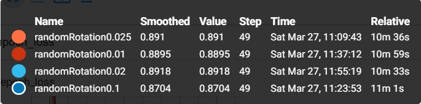
   
   График метрики качества
  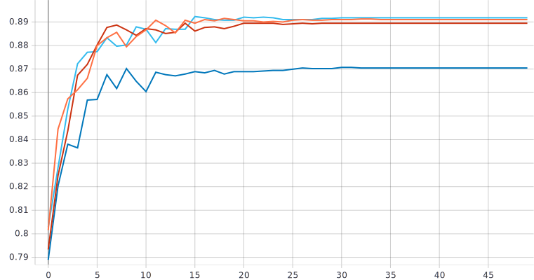
  
  - Для функции потерь
  
   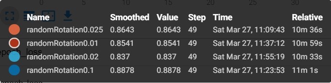
  
  График функции потерь
  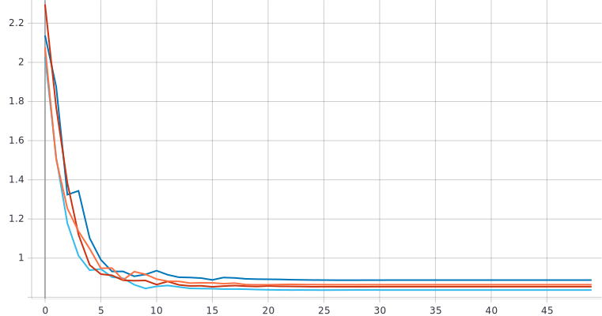
  
  ### Поворот изображения на случайный угол(влияние режимов заполнения):
  
  - Графики: 
- Только валидация

- Для метрики качества

 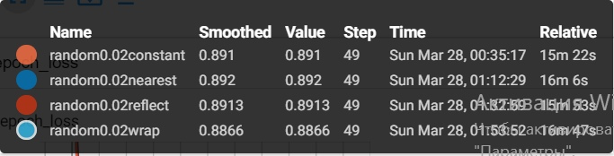
   
   График метрики качества
  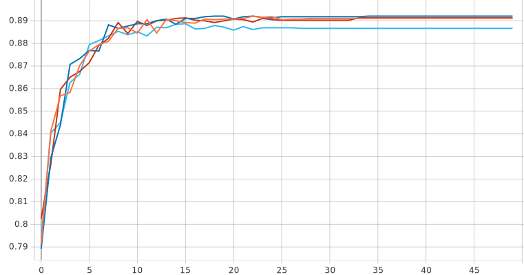
  
  - Для функции потерь
  
   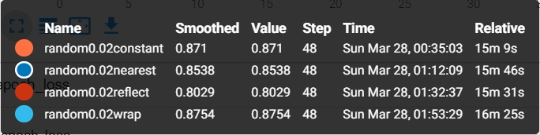
  
  График функции потерь
  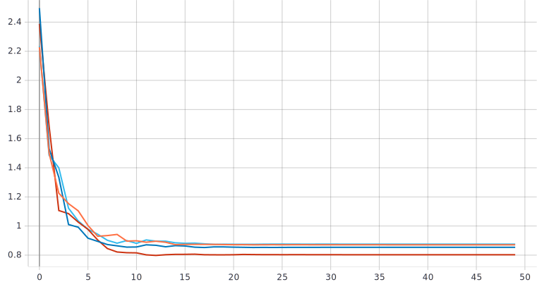
  
  ### Лучшими параметрами для данной части стали: поворот изображения на случайный угол от 0 до 2% * pi. При таких параметрах мы смогли достичь максимальной метрики качества(89,18% , что на 0,74% хуже чем у алгоритма  манипуляции с яркостью и контрастом и на 0,5% хуже чем у алгоритма без аугментации данных ) и наилучшей скорости сходимости(29 эпох , что на 3 эпохи хуже чем у алгоритма манипуляции с яркостью и контрастом и на 4 эпохи лучше чем у алгоритма без аугментации данных ). Режим заполнения(nearest) улучшил метрику качества на 0.02%,однако снизил скорость сходимости алгоритма на 4 эпохи.
  
 # 3) Добавление случайного шума
 
 - Графики: 
- Только валидация

- Для метрики качества

 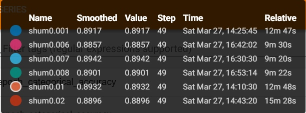
   
   График метрики качества
  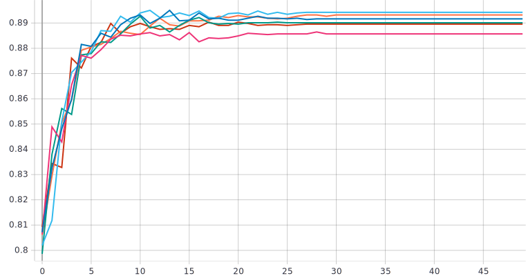
  
  - Для функции потерь
  
  
  
  График функции потерь
  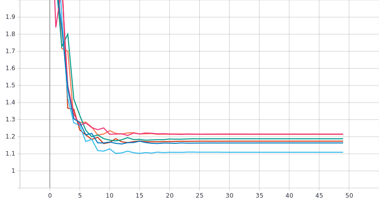
  ### Наилучший результат наблюдается при значении среднеквадратичного отклонения добавляемого шума, равном 0.007 При таких параметрах мы смогли достичь максимальной метрики качества(89,42% , что на 0,5% хуже чем у алгоритма  манипуляции с яркостью и контрастом,на 0,24% лучше чем у алгоритма с поворотом изображения, и на 0,26% хуже чем у алгоритма без аугментации данных ) и наилучшей скорости сходимости(25 эпох , что на 1 эпоху лучше чем у алгоритма манипуляции с яркостью и контрастом, на 4 эпохи лучше чем у алгоритма с поворотом изображения, и на 8 эпох лучше чем у алгоритма без аугментации данных ). 
 

# 4) Использование случайной части изображения:

 - Графики: 
- Только валидация

- Для метрики качества

 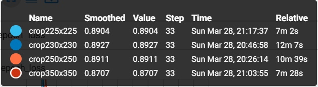
   
   График метрики качества
  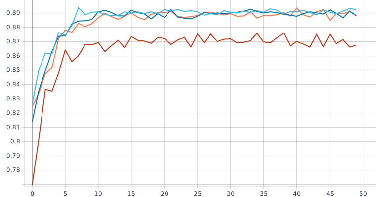
  
  ### Оптимальным размером изображения является 230X230 px, при таком размере мы получили наилучшую метрику качества (89,27% что на 0,09% лучше чем при повороте изображения, и на 0,15% хуже чем у алгоритма с шумами).
