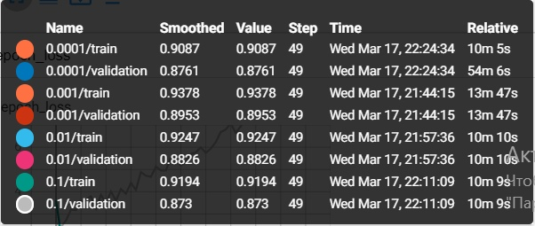
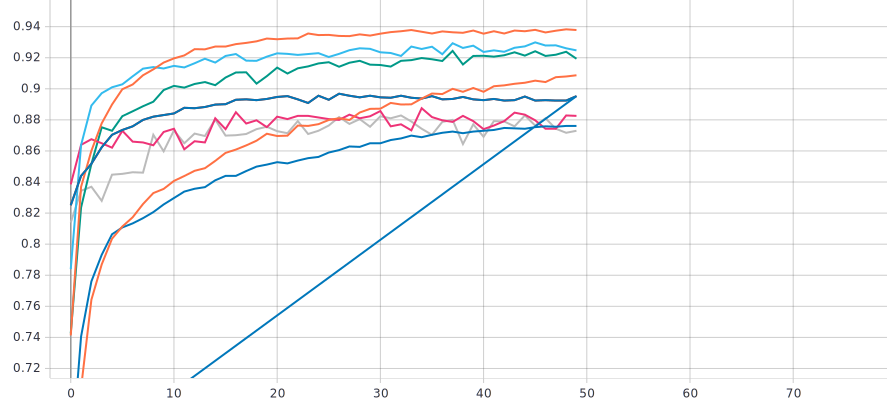
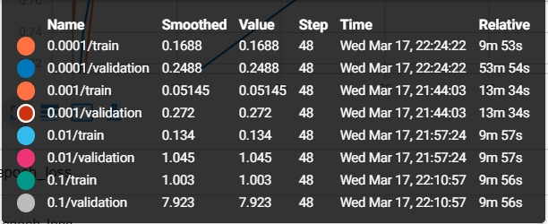
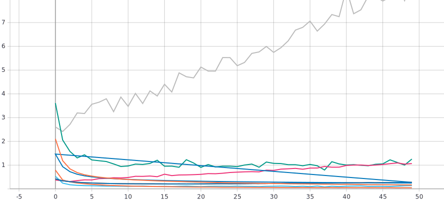
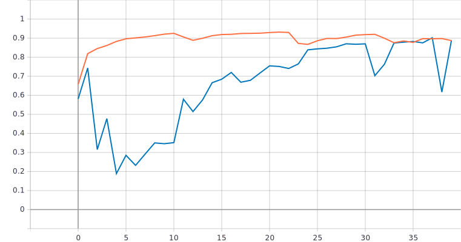
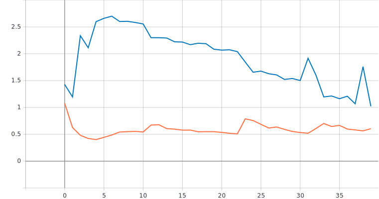

# Изучение влияние параметра “темп обучения” на процесс обучения нейронной сети на примере решения задачи классификации Oregon Wildlife с использованием техники обучения Transfer Learning

-Графики обучения:
-Для метрики качества

 
   
   График метрики качества
  
  
  -Для функции потерь
  
  
  
  График функции потерь
  


# С использованием [2] и техники обучения Transfer Learning [7] обучить нейронную сеть EfficientNet-B0 (предобученную на базе изображений imagenet) для решения задачи классификации изображений Oregon WildLife
-Архитектура:

```
   inputs = tf.keras.Input(shape=(RESIZE_TO, RESIZE_TO, 3))
  x = EfficientNetB0(include_top=False, input_tensor=inputs, pooling='avg', weights='imagenet')(inputs)
  
  x.trainable = False
  
  outputs = tf.keras.layers.Dense(NUM_CLASSES, activation=tf.keras.activations.softmax)(x)

  return tf.keras.Model(inputs=inputs, outputs=outputs)
```

-Графики обучения:
 - Валидация - синий цвет
 - Тренировка - оранжевый цвет
   
   График метрики качества
  
  
  График функции потерь
  

 # Анализ результатов
 На графиках первой задачи видно , что из-за случайного начального приближения качество обучения нейронной сети достигает максимум 70%. На графиках задачи 2 видно что качество обучения нейронной сети значительно увеличилось и дошло до ~90% , это достигается за счёт использования техники Transfer Learning которая позволяет использовать накопленный опыт от решения одной задачи, для другой. В данной задаче мы использовали нейронную сеть EfficientNet-B0 (предобученную на базе изображений imagenet). Данная нейронная сеть сначала обучалась на большом количестве данных, а затем использовалась на локальном наборе данных, что и привело к увеличению качества обучения.
