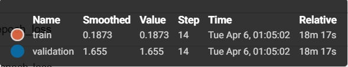

# Лабораторная работа #5.
 # Решение задачи классификации изображений из набора данных Oregon Wildlife с использованием нейронных сетей глубокого обучения и техники обучения Fine Tuning
### В данной лабораторной мы используем следующие значения для аугментации :

```
 example['image'] = tf.image.resize(example['image'], tf.constant([230, 230]))
```

```
 img = tf.image.adjust_contrast(image, 2)
```

```
 img = tf.image.adjust_brightness(img, 0.3)
```

```
 img_aug = tf.keras.layers.experimental.preprocessing.RandomRotation(factor=0.05, fill_mode='constant', fill_value=255)(inputs)
```

```
img_aug = tf.keras.layers.GaussianNoise(0.007)(img_aug)
```

#  С использованием примера [2], техники обучения Transfer Learning [1], оптимальной политики изменения темпа обучения, аугментации данных с оптимальными настройками обучить нейронную сеть EfficientNet-B0 (предварительно обученную на базе изображений imagenet) для решения задачи классификации изображений Oregon WildLife
 
- Графики: Transfer Learning

- Для точности

 
   
  - График точности
  
  
  - Для функции потерь
  
  
  
 - График функции потерь
  
  
  # С использованием техники обучения Fine Tuning дополнительно обучить нейронную сеть EfficientNet-B0 предварительно обученную в пункте 2

  - Графики: Fine Tuning

- Для точности

 
   
   - График точности
  
  
  - Для функции потерь
  
  
  
 - График функции потерь
  
  
 
